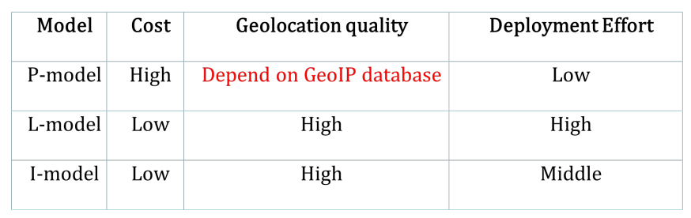
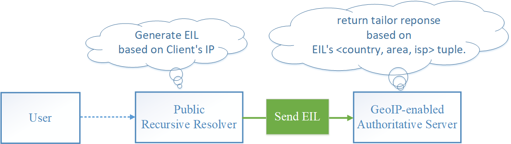

# dns_test_eil

install guide: [INSTALL.md](INSTALL.md)

## Background

[DNS Privacy Workshop 2017](https://www.internetsociety.org/events/ndss-symposium/ndss-symposium-2017/dns-privacy-workshop-2017-programme/dns-privacy-workshop)

[Paper: EIL_Dealing_with_the_Privacy_Problem_of_ECS](https://drive.google.com/open?id=0B5gNT4RRJ0xPaG9nZ045VXRrZzg)

[Slide: EILDealing with the Privacy Problem of ECS](https://drive.google.com/open?id=0B5gNT4RRJ0xPcUhuV2JlV2ZYWHc)

Draft (area-code : country subdivision code)
- latest draft: [draft.txt](ietf_draft/draft.txt)
- Status:       https://datatracker.ietf.org/doc/draft-pan-dnsop-edns-isp-location/

EDNS option code should be assigned by the expert review process as defined by the DNSEXT working group and the IESG. For test case, we set EIL's OPTION-CODE : 0xFDF0

AREA-CODE : use ISO 3166-2 standard country subdivision code, 6 octets

## Slide TOC

[Data Provider](#data-provider)

[GeoIP-enabled Authoritative Server](#geoip-enabled-authoritative-server)

[Public DNS](#public-dns)

[RFC7871: ECS](#rfc7871-ecs)

[DNS Privacy](#dns-privacy)

[EIL](#eil)

[EIL: P-model](#eil-p-model)

[EIL: L-model](#eil-l-model)

[EIL: I-model](#eil-i-model)

[EIL models trade off](#eil-models-trade-off)

[Support ECS and EIL at the same time](#support-ecs-and-eil-at-the-same-time)

[Path Calculation and Tailored DNS Response](#path-calculation-and-tailored-dns-response)

[EIL is sufficient for GeoIP-enabled Authoritative Nameserver](#eil-is-sufficient-for-geoip-enabled-authoritative-nameserver)

## Data Provider

IP transit  is expensive.

Avoid cross-ISP visit.

{: style="width: 70%" }

## GeoIP-enabled Authoritative Server

GeoIP-enabled AUTH  return tailor  response based on  the geolocation of Resolver’s IP.

Is the resolver's IP address close to the client's IP address?

Is  the  IP  geolocation  database used  by  AUTH with high quality?

{: style="width: 70%" }

## Public DNS

ISP Resolver’s IP is close to client’s IP.

Public DNS Resolver’s IP may not. 

{: style="width: 70%" }

## RFC7871: ECS

ECS carry client subnet information for AUTH.

Good:
- Better determine end user’s location.
- GeoIP-enabled AUTH map client subnet to user’s geolocation.

Bad:
- Leak client subnet on the resolution to AUTH.

{: style="width: 70%" }

## DNS Privacy

The more domains publish their zones on a third-party AUTH, 

the more end user privacy information can be gathered by the AUTH according to the ECS queries.

{: style="width: 70%" }

## EIL

COUNTRY-CODE: 2  octets
- defined  in ISO3166

AREA-CODE:  6 octets
- ISO  3166-2’s  country  subdivision  code 

ISP: 4 octets
- using  shortcut  names
- unique in COUNTRY

    <CN, 35,  TEL>  indicates <China, Fujian, China Telecom>

{: style="width: 70%" }

## EIL: P-model

P-model is close to ECS.

{: style="width: 70%" }

## EIL: L-model

L-model has the most precisely geolocation.

{: style="width: 70%" }

## EIL: I-model

I-model will benefit if the AUTH could not find the approximate geolocation of ISP recursive resolver.

{: style="width: 70%" }

## EIL models trade off 

P-model is the most recommended.

L-model  requires  firmware  upgrade  EIL  support  on the first-hop router.

{: style="width: 70%" }

## Support ECS and EIL at the same time

GeoIP-enabled AUTH can directly support EIL.

Recursive Resolver can choose to:
- send EIL query, if AUTH support EIL
- send ECS query, if AUTH support ECS
- send EIL query to replace ECS query  for user privacy concern, if AUTH both support ECS and EIL

{: style="width: 70%" }

## Path Calculation and Tailored DNS Response

Data Providers make path calculations to optimize content delivery on the Internet based on the network topology, considering many factors such as IP, RIPs, FIBs, AS Path hops, system load, content availability, path latency, etc.  

Note that, Data Providers have the full details of the clients, they can make any complex path calculations without ECS and EIL.

{: style="width: 70%" }

## EIL is sufficient for GeoIP-enabled Authoritative Nameserver

If the GeoIP-enabled Authoritative Nameservers support ECS, they can use the client subnet information of ECS instead of resolver's address for geolocation detecting.  

{: style="width: 70%" }

Alternative, the GeoIP-enabled Authoritative Nameservers can directly use the < COUNTRY, AREA, ISP > information of EIL without geolocation detecting.

{: style="width: 70%" }
